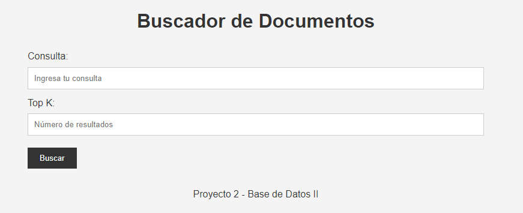
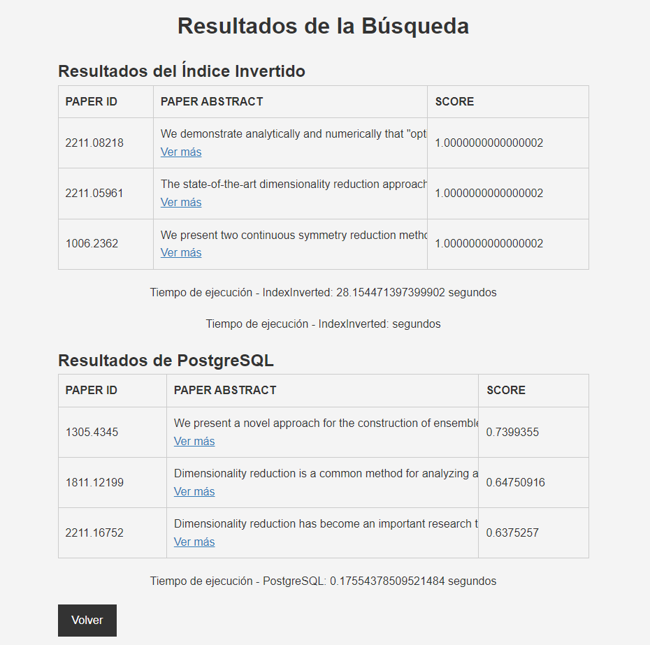

# Proyecto 2: Recuperación de Documentos de Texto

## Introducción
Este proyecto tiene como objetivo entender y aplicar algoritmos de búsqueda y recuperación de información basados en el contenido, enfocándose en la construcción óptima de un Índice Invertido para tareas de búsqueda y recuperación en documentos de texto.

## Dataset
Se utilizó el siguiente dataset: [arXiv Dataset](https://www.kaggle.com/datasets/Cornell-University/arxiv).

## Backend: Implementación del Índice Invertido
En esta sección, describimos cómo se implementa el índice invertido para la recuperación de texto.

### Preprocesamiento
El preprocesamiento de los datos es un paso crucial en la recuperación de información. Los siguientes pasos se llevan a cabo en esta fase:
- **Tokenización**: En esta fase, el texto se divide en palabras o términos. Este proceso es esencial para la construcción del índice invertido.
- **Filtrar Stopwords**: Las palabras comunes como 'y', 'o', 'el', 'la', etc., que no contribuyen significativamente a la búsqueda, se eliminan.
- **Reducción de palabras (Stemming)**: Las palabras se reducen a su raíz o forma base, lo que ayuda a mejorar la relevancia de la búsqueda. Por ejemplo, "corriendo" se convierte en "correr".

### Construcción del Índice
En esta etapa, se construye el índice invertido utilizando el preprocesamiento realizado:
- **Estructurar el índice invertido**: Se guarda información sobre los pesos TF-IDF (Frecuencia de Término - Frecuencia Inversa de Documento) de cada término en los documentos.
- **Cálculo de la longitud de cada documento**: Se calcula la longitud de cada documento y se reutiliza para calcular la similitud del coseno.
- **Construcción del índice en memoria secundaria**: Se utiliza el algoritmo Single-pass in-memory indexing (SPIMI) para la construcción del índice en memoria secundaria. Esto implica leer bloques de documentos, procesarlos y escribir bloques de índice parciales en el disco.

### Consulta
En esta etapa, se describen los pasos para procesar y recuperar documentos utilizando el índice invertido:
- **Procesamiento de la consulta**: Similar al preprocesamiento de documentos, la consulta se tokeniza, se filtran las stopwords y se aplica stemming.
- **Scoring y ranking**: Se utiliza la similitud de coseno para calcular un puntaje de relevancia para cada documento en relación con la consulta, y luego se clasifican los documentos según este puntaje.
- **Recuperación de documentos**: Finalmente, se devuelve una lista ordenada de documentos relevantes.

## Frontend: Full-Text Search

### Screenshots de la Interfaz de Usuario

## Link del video

https://drive.google.com/drive/folders/1loW9VXt7yz-a2xis1Vln2PKy0Ua6GFwd?usp=sharing
