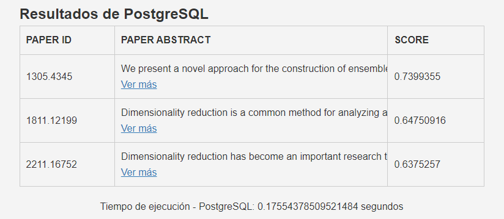

# Proyecto 2: Recuperación de Documentos de Texto

## Introducción
Este proyecto tiene como objetivo entender y aplicar algoritmos de búsqueda y recuperación de información basados en el contenido, enfocándose en la construcción óptima de un Índice Invertido para tareas de búsqueda y recuperación en documentos de texto.

## Dataset
Se utilizó el siguiente dataset: [arXiv Dataset](https://www.kaggle.com/datasets/Cornell-University/arxiv).

## Backend: Implementación del Índice Invertido

### Preprocesamiento

El preprocesamiento es la etapa en la que se preparan los datos para la indexación. Esto incluye:

- **Tokenización**: Se descompone el texto en palabras o tokens utilizando la librería `nltk`. Los tokens son generados a partir del texto y son validados usando la función `word_valid` en `spimi.py`.

- **Filtrado de Stop Words**: Se eliminan las palabras comunes (por ejemplo, "y", "o", "el", "la") que no tienen valor significativo en la búsqueda. Esto se logra mediante el uso de un conjunto de stop words en inglés y español proporcionado por `nltk`.

- **Stemming**: Se aplica un proceso de stemming utilizando el Snowball Stemmer de `nltk`. Esto convierte palabras a su raíz común (por ejemplo, "corriendo" se convierte en "correr"). Se utiliza la función `stem` en `spimi.py`.

### Construcción del Índice

- **Generación de Frecuencias de Términos**: Se utiliza un defaultdict para almacenar las frecuencias de términos por documento. Esto se realiza en la función `build_index` dentro de `spimi.py`.

- **Manejo de Memoria Secundaria**: Durante la construcción del índice, los bloques de índice se escriben en el disco una vez que alcanzan un tamaño máximo definido por `max_bytes_per_block`. Esto se hace para evitar el agotamiento de la memoria principal. Los bloques son escritos en un directorio llamado `blocks` y se utilizan archivos `.blk` para almacenar los bloques de índice.

- **Fusión de Bloques**: Una vez que todos los bloques de índice se han escrito en el disco, se fusionan en un solo índice invertido. Esto se realiza mediante las funciones `merge_blocks_in_dir` y `merge_blocks` en `spimi.py`.

- **Cálculo de IDF y Normas**: Se calculan los valores IDF (Frecuencia Inversa de Documento) y las normas para cada documento. Esto se hace utilizando las funciones `idfs_for_index` y `norms_for_index` en `spimi.py`.

### Ejecución Óptima de Consultas

- **Recuperación de Documentos**: Se realiza una consulta mediante la clase `Query` en `spimi.py`, la cual se encarga de recuperar los documentos relevantes utilizando el índice invertido construido.

- **Rankeo de Documentos**: Los documentos se rankean de acuerdo con la similitud del coseno entre el vector de consulta y los vectores de los documentos. Esto se calcula en la función `query` dentro de la clase `Query` en `spimi.py`.

## Aplicación Web

La aplicación web utiliza `Flask` para exponer un servidor web en el que los usuarios pueden interactuar con el sistema de recuperación de texto. Esta interfaz permite a los usuarios ingresar consultas y ver los documentos recuperados.

- **Inicialización del Servidor:** El servidor `Flask` es inicializado por el archivo `app.py`. Este archivo también define las rutas para diferentes funcionalidades de la aplicación web.

- **Interfaz de Usuario:** La interfaz de usuario está construida con `HTML` y permite a los usuarios ingresar consultas en un cuadro de búsqueda. Los resultados son mostrados en la misma página web.

- **Comunicación entre Backend y Frontend:** Cuando un usuario ingresa una consulta, la aplicación web envía esta consulta al backend a través de una llamada `HTTP`. El backend procesa la consulta utilizando el índice invertido y devuelve los documentos recuperados a la interfaz de usuario para su visualización. Para la elaboración del índice en PostgreSQL se utilizo el script SQL adjunto en el repositorio. Asimismo, para subir los datos a PostgreSQL, se generó un archivo .json (que utiliza como separador un salto de línea) para poblar la tabla papers. La información del archivo son los ids de cada paper junto a su abstract respectivo

## Frontend: Full-Text Search

El diseño del índice en este proyecto se basa en la utilización de PostgreSQL para almacenar y buscar documentos de texto completo. A través de la librería `SQLAlchemy`, el sistema se conecta a la base de datos `PostgreSQL` y realiza consultas para buscar documentos que coincidan con la consulta del usuario. 

### Integración con PostgreSQL

Para la elaboración del índice en PostgreSQL se utilizo el script SQL adjunto en el repositorio. Asimismo, para subir los datos a PostgreSQL, se generó un archivo .json (que utiliza como separador un salto de línea) para poblar la tabla papers. La información del archivo son los ids de cada paper junto a su abstract respectivo

### Screenshots de la Interfaz de Usuario

En los screenshots anteriores, podemos ver la interfaz de usuario de la aplicación. La primera imagen muestra la pantalla inicial donde los usuarios pueden ingresar sus consultas y especificar cuántos resultados desean ver. La segunda imagen muestra la página de resultados, donde los documentos recuperados se muestran en una tabla junto con sus puntuaciones de relevancia. Se muestran dos conjuntos de resultados, uno para la implementación propia basada en SPIMI y otro para la búsqueda en PostgreSQL. Además, el tiempo de ejecución de cada método se muestra debajo de los resultados correspondientes.

### Código Fuente Relevante

El frontend está construido principalmente con HTML y hace uso de plantillas de Flask para renderizar dinámicamente el contenido. Los archivos `buscador.html` y `resultados.html` contienen la estructura de las páginas de búsqueda y resultados, respectivamente. Estos archivos HTML se comunican con el backend a través de formularios y utilizan estilos CSS y JavaScript para mejorar la interfaz de usuario.

El archivo `app.py` es responsable de iniciar la aplicación Flask y define las rutas que manejan las solicitudes de los usuarios. Utiliza SQLAlchemy para interactuar con PostgreSQL y una implementación personalizada de SPIMI para la recuperación de información basada en un índice invertido.

## Link del video

https://drive.google.com/drive/folders/1loW9VXt7yz-a2xis1Vln2PKy0Ua6GFwd?usp=sharing
